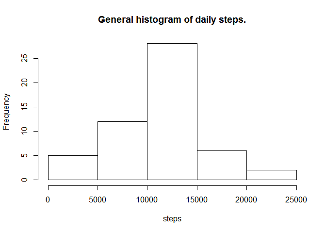
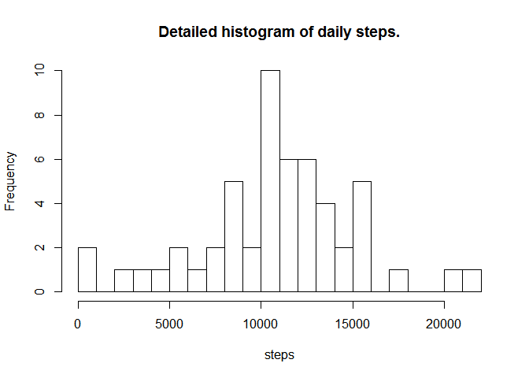
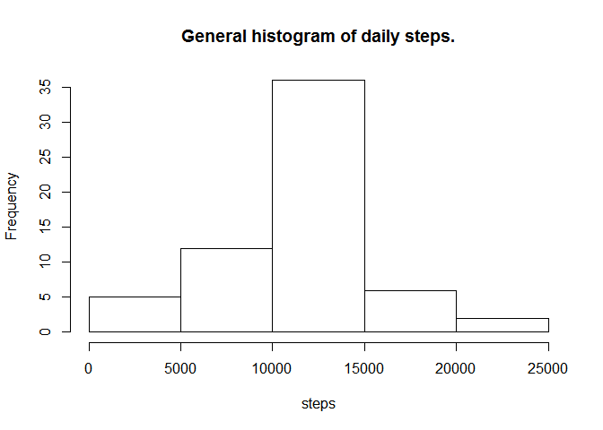
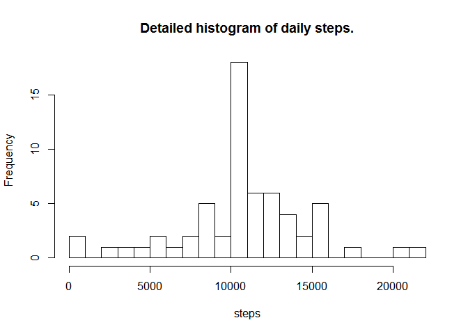
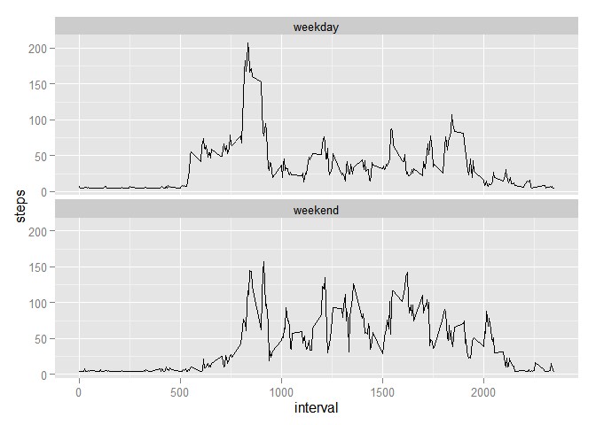

# Reproducible Research: Peer Assessment 1

## Loading and preprocessing the data

The following code sets the global options for this document:

- the code will be echoed;
- results will be shown;
- the scientific notation for numbers is disabled;
- numbers are rounded to 2 decimal values.


```r
suppressWarnings(library(knitr))
opts_chunk$set(echo = TRUE, results = "html")
options(scipen = 999, digits = 2)
```

To perform this analysis, first of all we need to unzip the data and to load it into R.
The unzip code in the example below is commented because otherwise it would generate an error within knitr.


```r
#unzip("activity.zip")
activity_data <- read.csv("activity.csv", stringsAsFactors = F)
```

Initially, I tried to convert the date column with the following formula (commented to prevent it from working on the data):


```r
# activity_data$date <- strptime(activity_data$date, format = "%Y-%m-%d")
```

In the end I decided to avoid this, as it made the aggregation of the data more complicated. That is because the *aggregate()* function doesn't take POSIXlt values, which contain nine fields (sec, min, hour, mday, mon, year, wday, yday, isdst) and generate errors.

## What is mean total number of steps taken per day?

To compute this data, I aggregated the steps by day first. I decided not to set the *na.rm* argument to *TRUE*, so that the na values would simply be disregarded in the histograms. I also renamed the columns of the aggregated data frame to make it tidier.

I then plotted two histograms to visualize the distribution of the data:

- the first histogram has the standard number of breaks;
- the second histogram has a higher number of breaks to show a more detailed distribution of the data.


```r
daily_activity_data <- aggregate(x = activity_data$steps, by = list(activity_data$date), FUN = "sum")
names(daily_activity_data) <- c("date", "steps")
hist_title <- "histogram of daily steps."
hist(daily_activity_data$steps, main = paste("General", hist_title), xlab = "steps")
```

 

```r
hist(daily_activity_data$steps, breaks = 30, main = paste("Detailed", hist_title), xlab = "steps")
```

 

```r
steps_mean <- mean(daily_activity_data$steps, na.rm = T)
steps_median <- median(daily_activity_data$steps, na.rm = T)
steps_sum <- sum(daily_activity_data$steps, na.rm = T)
```

As instructed, I also calculated some summary statistics. The mean value of the daily steps is 10766.19, the median is 10765, the total number of steps is 570608.


## What is the average daily activity pattern?

To answer this question, I aggregated the data again based on the minutes interval. The data is aggregated by calculating the average for each interval across all days. This time I had to set the *na.rm* argument of the *aggregate* function to *TRUE*, otherwise the plot would generate errors for those times when no steps were recorded.


```r
minute_activity_data <- aggregate(x = activity_data$steps, by = list(activity_data$interval), FUN = "mean", na.rm = T)
names(minute_activity_data) <- c("interval", "steps")
plot(steps ~ interval, data = minute_activity_data, type = "l")
```

 

```r
max_minute_steps <- max(minute_activity_data$steps)
sel_max_minute_interval <- which(minute_activity_data$steps == max_minute_steps)
max_minute_interval <- minute_activity_data[sel_max_minute_interval, "interval"]
```

Using an easily readable code, divideded in shorter chunks, I also computed the interval that has the highest average number of daily steps. It is the interval number 835 and it averaged 206.17 daily steps.

## Imputing missing values


```r
na_counter <- sum(!complete.cases(activity_data))
```

The *activity_data* data frame has 2304 rows containing na values.

It's interesting to note that, as the following exploratory code clearly shows, there are exactly 8 na values per interval.


```r
my_nas <- function(x) {
    sum(!complete.cases(x))
}
my_nas_output <- tapply(activity_data$steps, activity_data$interval, my_nas)
summary(my_nas_output)
```

```
##    Min. 1st Qu.  Median    Mean 3rd Qu.    Max. 
##       8       8       8       8       8       8
```

As per instructions, I created a copy of the data frame and used a function to substitute all NA values with the median of the corresponding interval.


```r
activity_data_narm <- activity_data
for(i in seq(from = 0, to = 2355, by = 5)) {
        val_mean <- round(mean(activity_data_narm$steps, na.rm = T))
        activity_data_narm[!complete.cases(activity_data_narm$steps), "steps"] <- val_mean
}
```

If I rerun the histograms and the summary statistics to the new data frame, I obtain these results:


```r
daily_activity_data_narm <- aggregate(x = activity_data_narm$steps, by = list(activity_data_narm$date), FUN = "sum")
names(daily_activity_data_narm) <- c("date", "steps")
hist_title <- "histogram of daily steps."
hist(daily_activity_data_narm$steps, main = paste("General", hist_title), xlab = "steps")
```

 

```r
hist(daily_activity_data_narm$steps, breaks = 30, main = paste("Detailed", hist_title), xlab = "steps")
```

 

```r
steps_mean_narm <- mean(daily_activity_data_narm$steps, na.rm = T)
steps_median_narm <- median(daily_activity_data_narm$steps, na.rm = T)
steps_sum_narm <- sum(daily_activity_data_narm$steps, na.rm = T)
```

The mean value of the daily steps has now become 10751.74 (from a previous value of 10766.19), the median has become 10656 (from a previous value of 10765), the total number of steps has become 655856 (from a previous value of 570608).

## Are there differences in activity patterns between weekdays and weekends?

First of all, I use a function to differentiate weekdays from weekends and to add this differentiation as a factor the the data frame without NAs. The code is written to work both with Italian and English weekdays, using both uppercase and lowercase English variants.


```r
weekend = c("sabato", "domenica", "saturday", "sunday", "Saturday", "Sunday")
for(i in 1:nrow(activity_data_narm)) {
        temp_weekday <- weekdays(strptime(activity_data_narm[i, "date"], format = "%Y-%m-%d"))
        if(temp_weekday %in% weekend) {
                activity_data_narm[i, "weekday"] <- "weekend"
        }
        else {
                activity_data_narm[i, "weekday"] <- "weekday"
        }
}
rm(temp_weekday)
activity_data_narm$weekday <- as.factor(activity_data_narm$weekday)
str(activity_data_narm)
```

```
## 'data.frame':	17568 obs. of  4 variables:
##  $ steps   : num  37 37 37 37 37 37 37 37 37 37 ...
##  $ date    : chr  "2012-10-01" "2012-10-01" "2012-10-01" "2012-10-01" ...
##  $ interval: int  0 5 10 15 20 25 30 35 40 45 ...
##  $ weekday : Factor w/ 2 levels "weekday","weekend": 1 1 1 1 1 1 1 1 1 1 ...
```

I then aggregate the data per weekday and interval, load ggplot2 and draw the graphs.


```r
act_weekday_interval <- aggregate(steps ~ interval+weekday,data = activity_data_narm,FUN=mean)

suppressWarnings(library(ggplot2))
act_weekday_plot <- ggplot(data = act_weekday_interval, aes(x = interval, y = steps))
act_weekday_plot <- act_weekday_plot + geom_line()
act_weekday_plot <- act_weekday_plot + facet_wrap(~ weekday, ncol = 1)
act_weekday_plot
```

 
